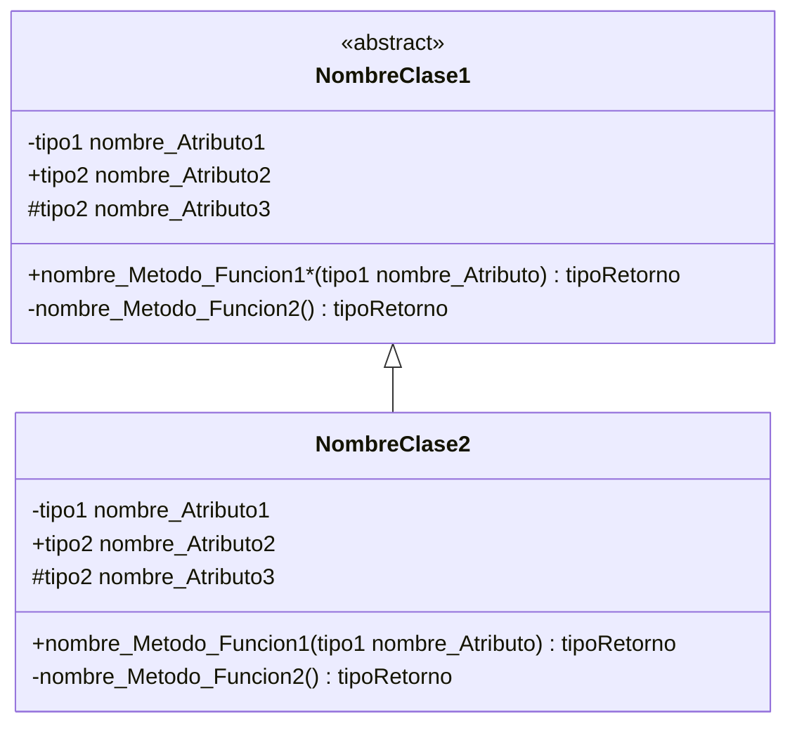
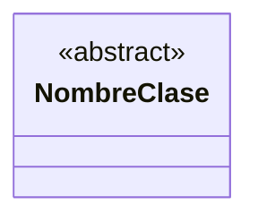
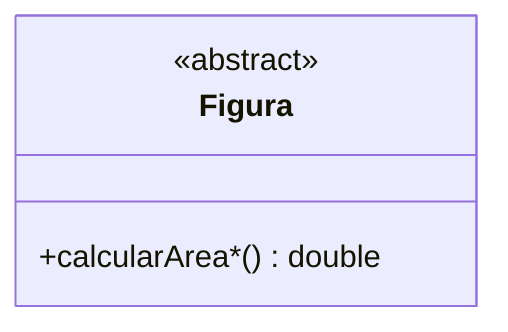
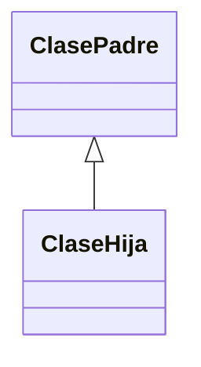
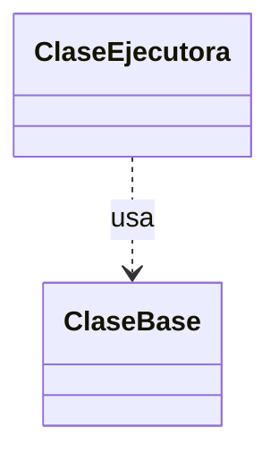
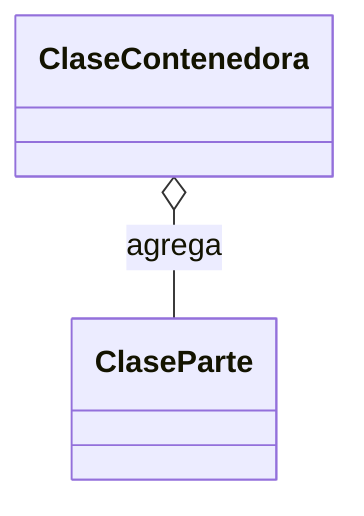
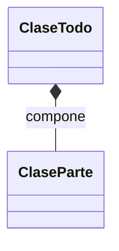

# Propuesta de Prompt para el Taller 8

## Programación Orientada a Objetos

**Carrera:** Ciencias de la Computación  
**Universidad:** Universidad Técnica Particular de Loja (UTPL)  
**Taller:** Taller 8  
**Tema central:** Herencia, polimorfismo, clases abstractas, métodos abstractos, UML y Java

---

## Objetivo del documento

Este documento presenta un prompt estructurado para revisar, generar y retroalimentar soluciones del **Taller 8** de la asignatura **Programación Orientada a Objetos**, considerando el modelado UML en archivos `.PNG` o `.DIA` y la implementación en código `.JAVA`.

El propósito es facilitar una revisión formativa y técnica de las soluciones de los estudiantes, tomando como base los contenidos estudiados sobre abstracción, encapsulamiento, herencia, polimorfismo, clases abstractas, métodos abstractos, relaciones UML, estructuras de datos y buenas prácticas de programación orientada a objetos.

---

# Prompt sugerido para el Taller 8

```text
Considerando el Taller 8: README.md adjunto, de la asignatura “PROGRAMACIÓN ORIENTADA A OBJETOS”, segundo ciclo, carrera de CIENCIAS DE LA COMPUTACIÓN de la UNIVERSIDAD TÉCNICA PARTICULAR DE LOJA: revisa, genera y retroalimenta las soluciones en modelado .PNG y código .JAVA adjuntas.

--------------------------------
Instrucciones adicionales
--------------------------------

1. Enunciado de referencia del taller/ejercicios:
   - Disponible en: https://github.com/POO-UTPL/APEB2_Taller8
   - Si no hay acceso al repositorio, utiliza el archivo README.md adjunto.

2. Subida de imágenes:
   - Se adjunta 1 imagen UML por ejercicio.
   - El formato puede ser .PNG o .DIA.

3. Generación TXT del UML:
   - A partir de cada imagen adjunta, extrae:
     - clases,
     - atributos,
     - métodos,
     - relaciones,
     - jerarquías de herencia,
     - clases abstractas,
     - métodos abstractos.

   - Genera el diagrama en formato Mermaid para ser exportado a StarUML.

   - Usa el siguiente formato:

classDiagram
class NombreClase1{
  <<abstract>>
  -tipo1 nombre_Atributo1
  +tipo2 nombre_Atributo2
  #tipo2 nombre_Atributo3
  +nombre_Metodo_Funcion1*(tipo1 nombre_Atributo) tipoRetorno
  -nombre_Metodo_Funcion2() tipoRetorno
}

class NombreClase2{
  -tipo1 nombre_Atributo1
  +tipo2 nombre_Atributo2
  #tipo2 nombre_Atributo3
  +nombre_Metodo_Funcion1(tipo1 nombre_Atributo) tipoRetorno
  -nombre_Metodo_Funcion2() tipoRetorno
}

NombreClase1 <|-- NombreClase2

   - Define los métodos abstractos con un asterisco (*) al final del nombre del método.
   - Define las clases abstractas con <<abstract>>, tal como se muestra en el ejemplo.
   - No incluyas texto adicional ni explicación dentro del bloque Mermaid.
   - Entrega únicamente el diagrama en formato Mermaid.

4. Generación de soluciones ideales:

   4.1. Diagrama de clases ideal

   Genera una versión corregida y optimizada del “Diagrama de clases”, aplicando criterios de:

   - eficiencia,
   - calidad,
   - abstracción,
   - encapsulamiento,
   - herencia,
   - polimorfismo,
   - clases abstractas,
   - métodos abstractos,
   - patrones de diseño,
   - principios SOLID,
   - buenas prácticas de Programación Orientada a Objetos.

   4.2. Código Java ideal

   Genera una versión corregida y optimizada del código `.java`, aplicando criterios de:

   - eficiencia,
   - calidad,
   - abstracción,
   - encapsulamiento,
   - herencia,
   - polimorfismo,
   - clases abstractas,
   - métodos abstractos,
   - patrones de diseño,
   - principios SOLID,
   - buenas prácticas de Programación Orientada a Objetos,
   - patrón arquitectónico MVC,
   - entradas y salidas de datos únicamente en el método `main()`,
   - uso correcto de sentencias de control selectivas,
   - uso correcto de sentencias de control repetitivas,
   - uso de arreglos estáticos,
   - uso de estructuras dinámicas como `ArrayList` y colecciones de objetos.

5. Contenidos estudiados para este taller:

   Unidad 1: Conceptos Principales de Programación Orientada a Objetos
   - Introducción al Paradigma de Programación Orientada a Objetos.
   - Introducción al Lenguaje Unificado de Modelado.
   - Pilares fundamentales de Programación Orientada a Objetos:
     - abstracción,
     - polimorfismo,
     - herencia,
     - encapsulación.
   - Clases y objetos.
   - Notación UML para clases y objetos.

   Unidad 2: Estructura y creación de programas en Programación Orientada a Objetos
   - Declaración de clases en lenguajes de alto nivel.
   - Manipulación de métodos en Programación Orientada a Objetos.
   - Creación y manipulación de objetos en lenguajes de alto nivel.
   - Uso de métodos establecer y obtener.
   - Manejo y sobrecarga de constructores.
   - Relación entre clases:
     - asociación,
     - agregación,
     - composición.

   Unidad 3: Manejo de Estructuras
   - Estructura de control en Programación Orientada a Objetos:
     - condicionales,
     - repetitivas.
   - Estructuras de datos en Programación Orientada a Objetos:
     - manejo de estructuras estáticas,
     - arreglos de objetos,
     - manejo de estructuras dinámicas,
     - ArrayList,
     - colecciones de objetos,
     - serialización de objetos.

   Unidad 4: Manejo de Herencia
   - Implementación de herencia en lenguaje de alto nivel.
   - Relación entre clases:
     - asociación,
     - agregación,
     - composición,
     - herencia.
   - Nombre, simbología, rol, navegabilidad y multiplicidad en UML.
   - Conceptos generales:
     - superclases,
     - subclases,
     - niveles de acceso.
   - Jerarquía de herencia en diagramas UML.
   - Invocación de constructores.
   - Implementación de herencia en lenguaje de alto nivel.

   Unidad 5: Implementación de Polimorfismo
   - Conceptos generales:
     - clases abstractas,
     - métodos abstractos.
   - Diseño de diagramas UML bajo el polimorfismo.
   - Implementación de polimorfismo en lenguaje de alto nivel.
   - Creación y uso de interfaces en lenguajes de alto nivel.

6. Retroalimentación y evaluación:

   - Compara el “Diagrama de clases” del estudiante con la “Solución ideal generada”.
   - Señala en máximo 1 línea las diferencias y mejoras principales para cumplir totalmente el enunciado del problema.
   - Compara el archivo `.java` del estudiante con la “Codificación ideal generada”.
   - Señala en máximo 1 línea las diferencias y mejoras principales para cumplir totalmente el enunciado del problema.
   - Genera un único informe con:
     - calificación cualitativa,
     - puntaje por criterio,
     - puntaje total,
     - retroalimentación breve y puntual.
---

7. Rúbrica de evaluación:

RÚBRICA DE EVALUACIÓN PARA LOS TALLERES DE RESOLUCIÓN DE PROBLEMAS CON HERENCIA, UML Y JAVA
⸻
CRITERIO: MODELADO
EXCELENTE (3.5 pts)
* Las clases representan correctamente la solución.
* La jerarquía de herencia es adecuada.
* Los atributos, métodos y relaciones son claros y coherentes.
SATISFACTORIO (2.8 pts)
* El modelado es correcto en su mayor parte.
* Presenta pequeñas omisiones o inconsistencias.
EN PROGRESO (2.1 pts)
* El modelado representa parcialmente la solución.
* Existen errores en clases, relaciones o herencia.
INICIADO (1.4 pts)
* El UML presenta múltiples inconsistencias.
* La estructura propuesta es poco clara.
AUSENTE (0.35 pts)
* No presenta UML o es totalmente incorrecto.
⸻
CRITERIO: IMPLEMENTACIÓN
EXCELENTE (3.5 pts)
* Implementa completamente el modelo diseñado.
* Aplica correctamente herencia, encapsulamiento y constructores.
* Presenta código claro y organizado.
SATISFACTORIO (2.8 pts)
* Implementa la mayoría de los requerimientos.
* Presenta errores menores de diseño o programación.
EN PROGRESO (2.1 pts)
* Implementa parcialmente la solución.
* Existen inconsistencias importantes con respecto al UML.
INICIADO (1.4 pts)
* La implementación es incompleta o difícil de comprender.
AUSENTE (0.35 pts)
* No existe implementación o es totalmente incomprensible.
⸻
CRITERIO: RESULTADOS / FUNCIONALIDAD
EXCELENTE (1.5 pts)
* Todos los resultados son correctos.
* El programa funciona sin errores.
SATISFACTORIO (1.2 pts)
* Los resultados son mayormente correctos.
* Presenta errores menores.
EN PROGRESO (0.9 pts)
* Solo cumple parcialmente los requerimientos.
INICIADO (0.6 pts)
* Los resultados son incompletos o poco confiables.
AUSENTE (0.15 pts)
* No genera resultados o estos no son válidos.
⸻
CRITERIO: VALIDACIÓN IA
EXCELENTE (1.5 pts)
* Presenta evidencias de revisión con IA y/o par académico.
* Integra mejoras relevantes derivadas de la retroalimentación recibida.
SATISFACTORIO (1.2 pts)
* Utiliza la retroalimentación recibida.
* Realiza algunas mejoras evidentes en su solución.
EN PROGRESO (0.9 pts)
* Revisa la retroalimentación recibida, pero aplica pocas mejoras.
INICIADO (0.6 pts)
* Existe evidencia mínima de revisión o mejoras.
AUSENTE (0.15 pts)
* No presenta evidencia de validación o mejora. 

```

---

# Formato Mermaid de referencia

> Este formato se debe utilizar para representar diagramas de clases con herencia, clases abstractas y métodos abstractos.



---

# Convenciones para el modelado Mermaid

## Visibilidad de atributos y métodos

| Símbolo | Significado |
|---|---|
| `+` | Público |
| `-` | Privado |
| `#` | Protegido |

## Clases abstractas

Las clases abstractas deben representarse usando:



## Métodos abstractos

Los métodos abstractos deben marcarse con un asterisco `*` al final del nombre del método:



## Herencia

La relación de herencia debe representarse con:



## Dependencia o uso

La relación de uso o dependencia debe representarse con:



## Agregación

La agregación puede representarse con:



## Composición

La composición puede representarse con:



---

## RESUMEN DE CALIFICACIÓN

| Criterio | Puntaje Máximo | Puntaje Obtenido |
|-----------|:-------------:|:---------------:|
| Modelado | 3.5 | |
| Implementación | 3.5 | |
| Resultados / Funcionalidad | 1.5 | |
| Validación con IA | 1.5 | |
| **TOTAL** | **10.0** | |

---

# ESCALA DE VALORACIÓN

| Nivel | Porcentaje |
|--------|:----------:|
| EXCELENTE | 100% |
| SATISFACTORIO | 80% |
| EN PROGRESO | 60% |
| INICIADO | 40% |
| AUSENTE | 10% |